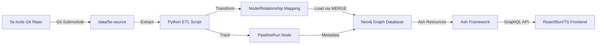

# Data Pipeline: Python ETL for 5e.tools Migration

This document describes the comprehensive approach for migrating 5e.tools data into Neo4j using a Python ETL (Extract, Transform, Load) pipeline with Git submodule tracking and pipeline state management.

## Strategy Overview

The data pipeline follows a three-tier architecture:

- **Python ETL**: Handles extraction, transformation, and loading of 5e.tools JSON data into Neo4j
- **Neo4j**: Stores the graph-structured D&D 5e game content
- **Ash Framework (Future)**: Provides declarative resources and GraphQL API for consuming the data

This separation of concerns allows Python to leverage its excellent JSON parsing capabilities and native Neo4j driver, while Elixir/Ash provides a type-safe, declarative interface for the application layer.

## Data Flow Architecture



## 1. Data Source Management: Git Submodule

To track the data pipeline from the forked repository into your data schema, the most robust method is to incorporate the `5etools-mirror-3/5etools-src` repository as a **Git Submodule**.

### Adding the Submodule

In your main project repository, add the 5e.tools source:

```bash
git submodule add https://github.com/5etools-mirror-3/5etools-src.git data/5e-source
git submodule update --init --recursive
```

This places the raw JSON files into `your-project-root/data/5e-source`.

### Tracking Data Versions

You can now see which specific commit of the 5e.tools data your local import script is using by checking:

```bash
git submodule status
```

This provides a direct, traceable link between your imported graph data and its origin. The commit hash can be retrieved programmatically:

```bash
cd data/5e-source
git rev-parse HEAD
```

### Updating the Submodule

When new data is available in the upstream repository:

```bash
cd data/5e-source
git pull origin main
cd ../..
git add data/5e-source
git commit -m "Update 5e.tools data submodule"
```

## 2. Python ETL Implementation

The Python ETL script handles the three core phases: Extract, Transform, and Load.

### Prerequisites

Install required Python packages:

```bash
pip install neo4j python-dotenv
```

### Extract Phase

The extract phase reads JSON files from the submodule directory:

```python
import json
import glob
from pathlib import Path

def extract_json_files(source_dir):
    """Extract all relevant JSON files from 5e-source directory."""
    patterns = [
        "data/class/*.json",
        "data/spell/*.json",
        "data/race/*.json",
        "data/background/*.json",
        "data/feat/*.json",
        "data/item/*.json"
    ]
    
    files = []
    for pattern in patterns:
        files.extend(glob.glob(str(Path(source_dir) / pattern)))
    
    return files

def load_json_file(file_path):
    """Load and parse a JSON file."""
    with open(file_path, 'r', encoding='utf-8') as f:
        return json.load(f)
```

### Transform Phase

The transform phase is the most critical part for creating a rich graph. It involves:

#### Node Creation

For each D&D entity (Class, Subclass, Spell, Feature, etc.), map JSON properties directly to Neo4j node properties:

```python
def transform_class(cls_data):
    """Transform a class JSON object into Neo4j node properties."""
    return {
        "name": cls_data["name"],
        "source": cls_data["source"],
        "hitDie": cls_data["hd"]["faces"],  # Access nested fields
        "proficiencies": json.dumps(cls_data.get("proficiency", {})),  # Store complex JSON as string
        "startingEquipment": json.dumps(cls_data.get("startingEquipment", [])),
        "slug": cls_data["name"].lower().replace(" ", "-")  # Create unique slug for easy lookup
    }
```

#### Relationship Identification

There are two types of relationships to handle:

**1. Pre-defined Relationships**

For relationships like `HAS_SUBCLASS` or `GRANTS_FEATURE`, explicitly create these as you process parent-child JSON structures:

```python
def process_class_subclasses(driver, class_node, class_data):
    """Process subclasses for a class."""
    for subclass_data in class_data.get("subclasses", []):
        # Create Subclass node
        subclass_props = transform_subclass(subclass_data)
        create_subclass_node(driver, subclass_props)
        
        # Create relationship
        create_relationship(
            driver,
            "Class", {"name": class_node["name"], "source": class_node["source"]},
            "HAS_SUBCLASS",
            "Subclass", {"name": subclass_props["name"], "source": subclass_props["source"]}
        )
```

**2. `{@tag}` Cross-References**

The 5e.tools data uses rich text entries with tags like `{@spell Fireball}` or `{@class Fighter}`. These require a two-pass approach:

**Pass 1: Create Primary Nodes**

```python
def pass_one_create_nodes(driver, all_data):
    """First pass: Create all primary nodes."""
    # Create all Classes
    for class_data in all_data.get("classes", []):
        create_class_node(driver, transform_class(class_data))
    
    # Create all Spells
    for spell_data in all_data.get("spells", []):
        create_spell_node(driver, transform_spell(spell_data))
    
    # Create all Features
    for feature_data in all_data.get("features", []):
        create_feature_node(driver, transform_feature(feature_data))
```

**Pass 2: Process Cross-References**

```python
import re

def extract_references(text):
    """Extract {@tag Name} references from rich text."""
    pattern = r'\{@(\w+)\s+([^}]+)\}'
    return re.findall(pattern, text)

def pass_two_create_relationships(driver, all_data):
    """Second pass: Create relationships from cross-references."""
    # Process all nodes with rich text entries
    for class_data in all_data.get("classes", []):
        for feature in class_data.get("classFeatures", []):
            entries = feature.get("entries", [])
            for entry in entries:
                if isinstance(entry, str):
                    refs = extract_references(entry)
                    for ref_type, ref_name in refs:
                        create_cross_reference(
                            driver,
                            "ClassFeature", {"name": feature["name"]},
                            f"REFERENCES_{ref_type.upper()}",
                            ref_type.capitalize(), {"name": ref_name}
                        )
```

#### Rich Text Entries

Store rich text entries as-is (JSON string or plain text). Your frontend (React/Bun/TS) can then decide how to render them, possibly using a markdown or tag parser.

### Load Phase

The load phase uses Neo4j's `MERGE` operations for idempotency and batching for performance.

#### Idempotency with MERGE

Always use `MERGE` statements in Cypher to prevent duplicate nodes/relationships:

```python
def merge_class_node(driver, class_props):
    """Merge a Class node (create or update)."""
    query = """
    MERGE (c:Class {name: $name, source: $source})
    ON CREATE SET 
        c.hitDie = $hitDie,
        c.proficiencies = $proficiencies,
        c.startingEquipment = $startingEquipment,
        c.slug = $slug,
        c.created_at = datetime()
    ON MATCH SET
        c.hitDie = $hitDie,
        c.proficiencies = $proficiencies,
        c.startingEquipment = $startingEquipment,
        c.slug = $slug,
        c.updated_at = datetime()
    RETURN c
    """
    with driver.session() as session:
        session.run(query, **class_props)
```

#### Relationship Creation

```python
def merge_relationship(driver, from_label, from_props, rel_type, to_label, to_props, rel_props=None):
    """Merge a relationship between two nodes."""
    query = f"""
    MATCH (from:{from_label} {{name: $from_name, source: $from_source}})
    MATCH (to:{to_label} {{name: $to_name, source: $to_source}})
    MERGE (from)-[r:{rel_type}]->(to)
    """
    if rel_props:
        query += " SET r += $rel_props"
    query += " RETURN r"
    
    params = {
        "from_name": from_props["name"],
        "from_source": from_props["source"],
        "to_name": to_props["name"],
        "to_source": to_props["source"]
    }
    if rel_props:
        params["rel_props"] = rel_props
    
    with driver.session() as session:
        session.run(query, **params)
```

#### Batching

For large imports, commit transactions in batches to improve performance:

```python
def batch_create_nodes(driver, nodes, batch_size=1000):
    """Create nodes in batches."""
    for i in range(0, len(nodes), batch_size):
        batch = nodes[i:i + batch_size]
        query = """
        UNWIND $nodes AS node
        MERGE (n:Class {name: node.name, source: node.source})
        SET n += node
        """
        with driver.session() as session:
            session.run(query, nodes=[dict(n) for n in batch])
```

#### Import Order

Process nodes in dependency order:

1. **Independent nodes**: `:Source` (if normalized), top-level `:Class`, `:Spell`, `:Feat`, `:Race`
2. **Dependent nodes**: `:Subclass`, `:ClassFeature`, `:Subrace`
3. **Relationships**: All relationship types

## 3. Pipeline Tracking in Neo4j

Beyond Git submodule tracking, record ETL run metadata directly in Neo4j.

### PipelineRun Node Schema

Create a dedicated `(:PipelineRun)` node with properties:

- `timestamp` (DateTime): When the pipeline run started
- `source_repo_commit_hash` (String): Git commit hash from `data/5e-source`
- `script_version` (String): Version of the Python ETL script
- `status` (String): "RUNNING", "SUCCESS", "FAILED"
- `nodes_created` (Integer): Count of nodes created
- `relationships_created` (Integer): Count of relationships created
- `start_time` (DateTime): Pipeline start timestamp
- `end_time` (DateTime): Pipeline completion timestamp (null if still running)
- `error_message` (String): Error details if status is "FAILED"

### Creating Pipeline Run Records

```python
import subprocess
from datetime import datetime
from neo4j import GraphDatabase

def get_submodule_commit_hash(submodule_path):
    """Get the current commit hash of the submodule."""
    result = subprocess.run(
        ["git", "rev-parse", "HEAD"],
        cwd=submodule_path,
        capture_output=True,
        text=True
    )
    return result.stdout.strip()

def create_pipeline_run(driver, submodule_path, script_version):
    """Create a PipelineRun node at the start of import."""
    commit_hash = get_submodule_commit_hash(submodule_path)
    
    query = """
    CREATE (p:PipelineRun {
        timestamp: datetime(),
        source_repo_commit_hash: $commit_hash,
        script_version: $script_version,
        status: 'RUNNING',
        start_time: datetime(),
        nodes_created: 0,
        relationships_created: 0
    })
    RETURN p
    """
    
    with driver.session() as session:
        result = session.run(query, commit_hash=commit_hash, script_version=script_version)
        return result.single()["p"]

def update_pipeline_run(driver, run_id, status, nodes_created=0, relationships_created=0, error_message=None):
    """Update a PipelineRun node on completion."""
    query = """
    MATCH (p:PipelineRun)
    WHERE id(p) = $run_id
    SET p.status = $status,
        p.end_time = datetime(),
        p.nodes_created = $nodes_created,
        p.relationships_created = $relationships_created
    """
    if error_message:
        query += ", p.error_message = $error_message"
    query += " RETURN p"
    
    params = {
        "run_id": run_id,
        "status": status,
        "nodes_created": nodes_created,
        "relationships_created": relationships_created
    }
    if error_message:
        params["error_message"] = error_message
    
    with driver.session() as session:
        session.run(query, **params)
```

### Querying Pipeline History

Query the latest import status:

```cypher
MATCH (p:PipelineRun)
RETURN p
ORDER BY p.timestamp DESC
LIMIT 1
```

Get all successful runs:

```cypher
MATCH (p:PipelineRun)
WHERE p.status = 'SUCCESS'
RETURN p.timestamp, p.source_repo_commit_hash, p.nodes_created, p.relationships_created
ORDER BY p.timestamp DESC
```

## 4. Complete ETL Script Structure

Here's a skeleton of a complete ETL script:

```python
#!/usr/bin/env python3
"""
5e.tools Data ETL Pipeline
Migrates 5e.tools JSON data into Neo4j graph database.
"""

import json
import glob
import re
import subprocess
from pathlib import Path
from datetime import datetime
from neo4j import GraphDatabase
from dotenv import load_dotenv
import os

# Load environment variables
load_dotenv()

# Configuration
NEO4J_URI = os.getenv("NEO4J_URI", "bolt://localhost:7687")
NEO4J_USER = os.getenv("NEO4J_USER", "neo4j")
NEO4J_PASSWORD = os.getenv("NEO4J_PASSWORD", "password")
SOURCE_DIR = os.getenv("SOURCE_DIR", "data/5e-source")
SCRIPT_VERSION = "1.0.0"
BATCH_SIZE = 1000

def main():
    # Connect to Neo4j
    driver = GraphDatabase.driver(NEO4J_URI, auth=(NEO4J_USER, NEO4J_PASSWORD))
    
    try:
        # Create pipeline run record
        run_node = create_pipeline_run(driver, SOURCE_DIR, SCRIPT_VERSION)
        run_id = run_node.id
        
        # Extract all JSON files
        json_files = extract_json_files(SOURCE_DIR)
        
        # Load all data
        all_data = {}
        for file_path in json_files:
            data = load_json_file(file_path)
            # Merge into all_data based on file type
        
        # Pass 1: Create all primary nodes
        nodes_created = pass_one_create_nodes(driver, all_data)
        
        # Pass 2: Create relationships from cross-references
        relationships_created = pass_two_create_relationships(driver, all_data)
        
        # Update pipeline run
        update_pipeline_run(
            driver, run_id, "SUCCESS",
            nodes_created=nodes_created,
            relationships_created=relationships_created
        )
        
        print(f"Import completed successfully!")
        print(f"Nodes created: {nodes_created}")
        print(f"Relationships created: {relationships_created}")
        
    except Exception as e:
        # Update pipeline run with error
        update_pipeline_run(
            driver, run_id, "FAILED",
            error_message=str(e)
        )
        raise
    finally:
        driver.close()

if __name__ == "__main__":
    main()
```

## 5. Future Integration: Ash Framework

Once the data is in Neo4j, Ash Framework (using `AshNeo4j.DataLayer`) will provide a powerful and declarative way to interact with it.

### Ash Resource Definition

Define Ash Resources that map to your Neo4j node labels:

```elixir
defmodule Kino.RPG.Class do
  use Ash.Resource,
    data_layer: AshNeo4j.DataLayer

  attributes do
    attribute :name, :string, primary_key?: true, allow_nil?: false
    attribute :source, :string, allow_nil?: false
    attribute :hit_die, :integer
    attribute :slug, :string
    attribute :proficiencies, :string  # JSON stored as string
    attribute :starting_equipment, :string  # JSON stored as string
  end

  relationships do
    has_many :subclasses, Kino.RPG.Subclass do
      destination_attribute :class_name
    end

    has_many :features, Kino.RPG.ClassFeature do
      destination_attribute :class_name
    end
  end

  actions do
    defaults [:read, :destroy]
    create :create
    update :update
  end
end
```

### GraphQL API

AshGraphql will automatically expose these resources and their relationships via your Phoenix GraphQL endpoint:

```graphql
query {
  classes {
    name
    source
    hitDie
    subclasses {
      name
    }
    features {
      name
      level
    }
  }
}
```

This provides end-to-end type safety from Neo4j through Elixir to your React/Bun/TS frontend.

## Best Practices

1. **Always use MERGE**: Prevents duplicate nodes and relationships on re-runs
2. **Batch operations**: Process in batches of 1000 for optimal performance
3. **Two-pass approach**: Create nodes first, then relationships to avoid missing references
4. **Track pipeline runs**: Always create PipelineRun nodes for auditability
5. **Handle errors gracefully**: Update PipelineRun status on failures
6. **Version your script**: Include script version in PipelineRun for reproducibility
7. **Test incrementally**: Start with a small subset of data before full import

## Troubleshooting

### Missing Cross-References

If cross-references fail to create relationships, ensure:
- Pass 1 completed successfully (all target nodes exist)
- Reference names match exactly (case-sensitive)
- Source property is included in node matching

### Performance Issues

- Reduce batch size if memory is constrained
- Process entity types sequentially rather than interleaved
- Use indexes on frequently matched properties (name, source)

### Git Submodule Issues

If the submodule appears empty:
```bash
git submodule update --init --recursive
```

## Related Documentation

- [Data Import Guide](DATA_IMPORT.md) - Current Elixir-based import approach
- [Architecture Documentation](ARCHITECTURE.md) - Graph schema and data model
- [Neo4j Setup Guide](START_WITH_EXISTING_NEO4J.md) - Neo4j configuration

