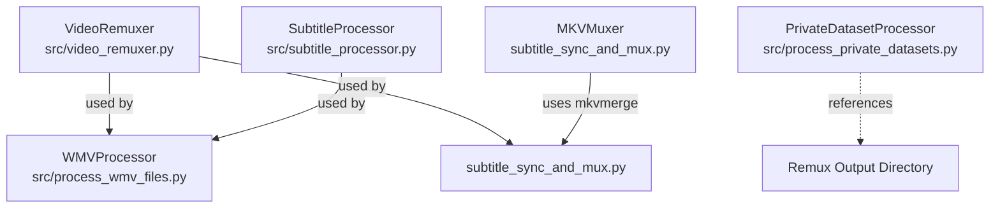

# Remux Pipeline Documentation

## Overview

The codebase contains a comprehensive media remuxing (container conversion) pipeline built around FFmpeg, with support for subtitle embedding, audio extraction, and batch processing. The system uses "remux" as the term for container operations that preserve video/audio quality while changing formats (primarily to .mkv).

## Core Components

### 1. Core Remux Engine

**[src/video_remuxer.py](../src/video_remuxer.py)** - Main remuxing engine

- **VideoRemuxer class**: Core FFmpeg-based remuxing functionality
- **RemuxJob dataclass**: Configuration for remux operations
- **VideoInfo dataclass**: Video metadata structure
- **Key methods**:
  - `remux_with_subtitles()`: Embeds subtitle tracks into video containers
  - `remux_without_subtitles()`: Simple container conversion (e.g., .wmv -> .mkv)
  - `batch_remux()`: Batch processing of multiple videos
  - `get_video_info()`: Extract video metadata using ffprobe
  - `extract_audio()`: Extract audio tracks for ASR processing

### 2. Processing Scripts

#### A. WMV File Processor

**[src/process_wmv_files.py](../src/process_wmv_files.py)** - Windows Media Video processing script

- **WMVProcessor class**: Processes .wmv files in datasets
- **Uses**: `VideoRemuxer`, `SubtitleProcessor`
- **Functionality**:
  - Discovers .wmv files recursively
  - Extracts audio tracks for ASR
  - Remuxes videos to .mkv format (preserving quality)
  - Creates organized output directory structure
  - Generates processing metadata and logs
- **CLI Usage**:
```bash
python src/process_wmv_files.py --dataset Datasets/.princesslexie
python src/process_wmv_files.py --file path/to/video.wmv --no-audio
python src/process_wmv_files.py --dataset Datasets/.shay --no-preserve-quality
```

#### B. Subtitle Sync and Mux

**[subtitle_sync_and_mux.py](../subtitle_sync_and_mux.py)** - Subtitle synchronization and MKV muxing

- **SubtitleSynchronizer class**: Synchronizes transcript segments with video timing
- **MKVMuxer class**: Uses mkvmerge (MKVToolNix) for subtitle embedding
- **Uses**: `VideoRemuxer` from src.video_remuxer
- **Functionality**:
  - Creates optimized subtitle entries from transcript segments
  - Generates SRT and VTT subtitle files
  - Muxes subtitles into MKV containers using mkvmerge
  - Handles subtitle timing optimization and text wrapping
- **Note**: This script uses both FFmpeg (via VideoRemuxer) and mkvmerge tools

#### C. Private Dataset Processor

**[src/process_private_datasets.py](../src/process_private_datasets.py)** - ASR processing with remux integration

- **PrivateDatasetProcessor class**: Processes private datasets with ASR
- **Remux reference**: Defines remux output paths in dataset structure
- **Status**: Template/placeholder - mentions remux but doesn't actively use VideoRemuxer yet
- **Note**: Lines 112, 148 reference remux output directories, but actual remuxing is not implemented in the current version

### 3. Supporting Modules

#### A. Subtitle Processing

**[src/subtitle_processor.py](../src/subtitle_processor.py)** - Subtitle generation and formatting

- **SubtitleProcessor class**: Generates timed subtitle files from transcription data
- **Formats**: ASS, SRT, VTT
- **Used by**: `process_wmv_files.py` (imported but not heavily used in current implementation)
- **Functionality**:
  - Creates timed segments from transcripts
  - Formats subtitles with proper timing
  - Wraps text for readability
  - Generates multiple subtitle formats

**[src/subtitle_formatter.py](../src/subtitle_formatter.py)** - Subtitle format conversion

- **SubtitleFormatter class**: Converts between subtitle formats
- **ContainerManager class**: Manages video container capabilities
- **Status**: Related to remux workflow but not directly imported by remux scripts
- **Functionality**:
  - Format detection and validation
  - Conversion between ASS/SRT/VTT/TTML/SBV
  - Container format information (MKV, MP4, AVI)

## Script Relationships



## Key Features

### Remux Operations

1. **Quality Preservation**: By default, remuxing uses `-c copy` to avoid re-encoding
2. **Subtitle Embedding**: Supports ASS, SRT, VTT formats embedded into MKV containers
3. **Batch Processing**: Can process entire directories of video files
4. **Audio Extraction**: Extracts audio tracks (16kHz mono WAV) for ASR processing

### Output Structure

Scripts create organized output directories:

- `outputs/remux/` - Remuxed video files (.mkv)
- `outputs/audio/` - Extracted audio tracks (.wav)
- `outputs/subtitles/` - Subtitle files (.srt, .ass, .vtt)
- `outputs/metadata/` - Processing metadata and logs

## Dependencies

### External Tools

- **FFmpeg**: Required for video remuxing and audio extraction
- **ffprobe**: Required for video metadata extraction
- **mkvmerge** (MKVToolNix): Used by subtitle_sync_and_mux.py for subtitle embedding

### Python Dependencies

- Standard library: subprocess, json, pathlib, logging, dataclasses
- For IMDB file naming: `cinemagoer>=2023.5.1` (see IMDB File Naming Tooling section)
- No other external Python packages required for core remuxing (uses subprocess to call FFmpeg)

## Usage Patterns

1. **Single Video Remux**: Use VideoRemuxer directly or process_wmv_files.py with --file
2. **Batch WMV Processing**: Use process_wmv_files.py with --dataset
3. **Subtitle Workflow**: Use subtitle_sync_and_mux.py for transcript-to-subtitle-to-MKV pipeline
4. **Quality Control**: Use --no-preserve-quality flag to re-encode (smaller files, quality loss)

## Files Summary

| File | Type | Purpose | Direct Remux Usage |
|------|------|---------|-------------------|
| `src/video_remuxer.py` | Core Module | FFmpeg remuxing engine | Yes - Core |
| `src/process_wmv_files.py` | Script | WMV file processing | Yes - Uses VideoRemuxer |
| `subtitle_sync_and_mux.py` | Script | Subtitle sync + MKV muxing | Yes - Uses VideoRemuxer + mkvmerge |
| `src/process_private_datasets.py` | Script | ASR processing template | No - Only references remux dirs |
| `src/subtitle_processor.py` | Support Module | Subtitle generation | Indirect - Used by WMV processor |
| `src/subtitle_formatter.py` | Support Module | Format conversion | No - Standalone utility |
| `src/dvd_processor.py` | Core Module | DVD title extraction | Yes - DVD processing |
| `src/dvd_classifier.py` | Support Module | Title classification | Yes - DVD processing |
| `src/plex_organizer.py` | Support Module | Plex organization | Yes - DVD processing |
| `process_dvd_to_plex.py` | Script | DVD to Plex pipeline | Yes - Orchestrates DVD modules |
| `src/imdb_matcher.py` | Support Module | IMDB lookup and matching | Yes - IMDB naming |
| `src/file_naming_policy.py` | Support Module | Naming convention definitions | Yes - IMDB naming |
| `src/video_file_discovery.py` | Support Module | Video file discovery | Yes - IMDB naming |
| `src/file_renamer.py` | Core Module | Renaming orchestrator | Yes - IMDB naming |
| `imdb_file_namer.py` | Script | IMDB file naming CLI | Yes - IMDB naming |

## DVD to Plex Processing

The codebase includes a specialized DVD processing pipeline for converting raw DVD backups (VIDEO_TS structure) to Plex-compatible MKV files.

### Components

- **`src/dvd_processor.py`** - Module 1: DVD title extraction (MakeMKV/FFmpeg)
- **`src/dvd_classifier.py`** - Module 2: Title classification by duration
- **`src/plex_organizer.py`** - Module 3: Plex file organization and naming
- **`process_dvd_to_plex.py`** - Main orchestration script

### Key Features

- Extracts all titles from DVD VIDEO_TS backups
- Automatic classification of main feature vs extras
- Plex-compatible naming conventions
- Quality preservation (stream copy, no re-encoding)
- MakeMKV preferred, FFmpeg fallback

### Documentation

See [DVD_TO_PLEX.md](DVD_TO_PLEX.md) for comprehensive usage guide, dependency information, and troubleshooting.

## IMDB File Naming Tooling

The codebase includes tooling to automatically discover video files, match them to IMDB entries, and rename files/folders according to a naming policy that includes IMDB tags (e.g., `Ballerina (2006) [tt0898897].mkv`).

### Naming Convention

**Format**: `{Title} ({Year}) [{imdb_id}].{ext}`

**Examples**:
- File: `Ballerina (2006) [tt0898897].mkv`
- Folder: `Ballerina (2006) [tt0898897]/`

**Edge Cases**:
- If no year found: `{Title} [{imdb_id}].{ext}`
- If no IMDB match: `{Title} ({Year}).{ext}` (no IMDB tag)
- Special characters are sanitized for filesystem compatibility

### Components

#### A. IMDB Matcher

**[src/imdb_matcher.py](../src/imdb_matcher.py)** - IMDB lookup and matching

- **IMDBMatcher class**: Searches IMDB and fetches metadata
- **IMDBResult dataclass**: Stores IMDB ID, title, year, type, rating
- Uses `cinemagoer` library for IMDB API access
- Handles fuzzy matching when exact title/year don't match
- Caches results to avoid repeated API calls
- **Key methods**:
  - `search_imdb(title, year)`: Search IMDB by title and optional year
  - `get_imdb_by_id(imdb_id)`: Fetch metadata directly by IMDB ID

#### B. File Naming Policy

**[src/file_naming_policy.py](../src/file_naming_policy.py)** - Naming convention definitions

- **FileNamingPolicy class**: Defines and enforces naming conventions
- **Key methods**:
  - `generate_filename(title, year, imdb_id, extension)`: Generate filename with IMDB tag
  - `generate_foldername(title, year, imdb_id)`: Generate folder name with IMDB tag
  - `parse_existing_filename(filename)`: Extract metadata from existing filenames
  - `sanitize_title(title)`: Sanitize titles for filesystem compatibility

#### C. Video File Discovery

**[src/video_file_discovery.py](../src/video_file_discovery.py)** - Video file discovery

- **VideoFileDiscovery class**: Discovers video files in directories
- **VideoFile dataclass**: Stores file path and parsed metadata (title, year, IMDB ID)
- Parses existing filenames to extract title/year hints
- Supports common video extensions: `.mkv`, `.mp4`, `.avi`, `.wmv`, `.mov`, `.flv`, etc.
- **Key methods**:
  - `discover_video_files(directory, recursive)`: Find all video files
  - `discover_single_file(file_path)`: Discover and parse a single file

#### D. File Renamer

**[src/file_renamer.py](../src/file_renamer.py)** - Main renaming orchestrator

- **FileRenamer class**: Orchestrates discovery, matching, and renaming
- **RenamingResult dataclass**: Tracks renaming operations (old path, new path, status)
- Interactive mode: Prompts user to confirm matches before renaming
- Handles conflicts: Skips if target already exists
- **Key methods**:
  - `process_directory(directory, dry_run, rename_folders)`: Process entire directory
  - `process_single_file(file_path, dry_run)`: Process single file
  - `rename_folder(folder_path, imdb_result, dry_run)`: Rename folder with IMDB tag

#### E. CLI Script

**[imdb_file_namer.py](../imdb_file_namer.py)** - Command-line interface

- Main entry point for IMDB file naming operations
- **CLI Usage**:
```bash
# Dry run on a directory (shows what would be renamed)
python imdb_file_namer.py --directory /path/to/videos --dry-run

# Process with auto-confirm (no prompts)
python imdb_file_namer.py --directory /path/to/videos --yes

# Process single file
python imdb_file_namer.py --file /path/to/video.mkv

# Process and also rename parent folders
python imdb_file_namer.py --directory /path/to/videos --rename-folders --yes

# Interactive mode (prompt for each file)
python imdb_file_namer.py --directory /path/to/videos --interactive
```

**CLI Options**:
- `--directory`, `-d`: Directory to process (searches recursively)
- `--file`, `-f`: Single video file to process
- `--dry-run`: Show what would be renamed without actually renaming
- `--yes`, `-y`: Auto-confirm all matches (non-interactive mode)
- `--interactive`, `-i`: Interactive mode (prompt for confirmation)
- `--rename-folders`: Also rename parent folders if they match movie name
- `--cache-dir`: Directory for IMDB lookup cache
- `--verbose`, `-v`: Enable verbose logging

### Integration with Existing Pipeline

The IMDB file naming tooling integrates with existing remux workflows:

- **After Remuxing**: Rename remuxed files with IMDB tags for better organization
- **DVD to Plex**: Can add IMDB tags during or after Plex organization
- **WMV Processing**: Can rename processed files with IMDB metadata
- **Standalone**: Works independently to organize existing video collections

### Dependencies

**New Python packages**:
- `cinemagoer>=2023.5.1`: Python IMDB API wrapper (installed via requirements.txt)

**Existing dependencies used**:
- Standard library: `pathlib`, `logging`, `dataclasses`, `typing`

### Files Summary (Updated)

| File | Type | Purpose | IMDB Naming |
|------|------|---------|-------------|
| `src/imdb_matcher.py` | Support Module | IMDB lookup and matching | Yes - Core |
| `src/file_naming_policy.py` | Support Module | Naming convention definitions | Yes - Core |
| `src/video_file_discovery.py` | Support Module | Video file discovery | Yes - Used by renamer |
| `src/file_renamer.py` | Core Module | Renaming orchestrator | Yes - Core |
| `imdb_file_namer.py` | Script | IMDB file naming CLI | Yes - CLI entry point |

## Notes

- The term "remux" in this codebase refers specifically to container conversion (no re-encoding)
- Default output format is Matroska (.mkv) for better subtitle support
- All scripts include comprehensive error handling and logging
- Processing metadata is saved as JSON for tracking and debugging

