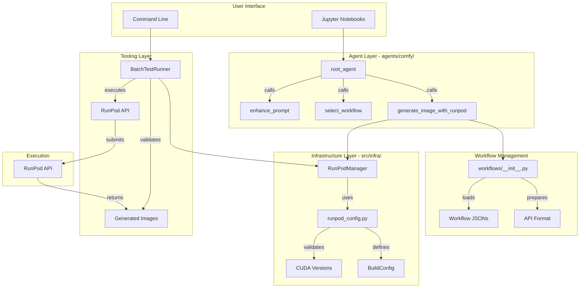

# ComfyUI Middleware Architecture

**Last Updated:** 2025-12-19  
**Status:** Production-ready with batch testing framework

## System Overview

The ComfyUI middleware provides a complete automation layer for ComfyUI workflows running on RunPod infrastructure. The system is organized into three main layers:

1. **Agent Layer** (`agents/comfy/`) - Google ADK agent orchestration
2. **Infrastructure Layer** (`src/infra/`) - RunPod deployment and configuration
3. **Testing Layer** (`agents/comfy/batch_runner.py`) - Batch validation framework

## Architecture Diagram



## Directory Structure

```
agents/comfy/
├── __init__.py              # Exports: root_agent, BatchTestRunner
├── agent.py                 # Root agent orchestration (Google ADK)
├── config.py                # Environment config, API keys, paths
├── tools.py                 # Core tools: generate_image_with_runpod, enhance_prompt
├── prompts.py               # Z-Image Turbo prompt templates
├── debug.py                 # Logging infrastructure (get_logger, Timer)
├── callbacks.py             # Event callbacks (LoggingCallback, MetricsCallback)
├── batch_runner.py          # Batch testing framework (NEW)
├── workflows/               # Workflow management
│   └── __init__.py         # load_workflow, prepare_workflow_for_api, create_z_image_turbo_workflow
├── sub_agents/              # Specialized sub-agents (legacy, not currently used)
│   ├── prompt_enhancer.py
│   └── workflow_selector.py
└── tests/                   # Unit tests
    ├── test_agent.py
    ├── test_tools.py
    └── conftest.py

src/infra/
├── runpod_config.py         # BuildConfig, CUDA validation, deployment configs
└── runpod_manager.py        # RunPodManager with build_and_deploy_custom_image

notebooks/comfy/
├── batch_test_workflows.ipynb  # Batch testing demo notebook
└── runpod_runner.py         # RunPodWorkflowRunner (shared utility)

data/Comfy_Workflow/         # Workflow JSON files
└── test_config.json         # Batch test configuration

config/runpod_deployments/
└── comfyui-custom-build.yaml  # Example deployment config
```

## Component Details

### 1. Agent Layer (`agents/comfy/`)

**Root Agent** (`agent.py`):
- Google ADK agent that orchestrates the complete workflow
- Calls tools in sequence: enhance_prompt → select_workflow → generate_image_with_runpod
- Uses LiteLLM with OpenRouter (Gemini 2.5 Flash)
- Returns filepath, not image data (token efficiency)

**Tools** (`tools.py`):
- `generate_image_with_runpod()` - Main image generation tool
  - Loads workflow from JSON or creates programmatic workflow
  - Submits to RunPod via RunPodWorkflowRunner
  - Polls for completion (max 10 minutes)
  - Saves image to `outputs/` directory
  - Returns metadata only (no base64 to avoid token overflow)

- `enhance_prompt()` - Z-Image Turbo prompt enhancement
  - Uses LLM to convert user prompt to detailed Chinese description
  - Optimized for Qwen 3.4B CLIP model

- `select_workflow()` - Workflow selection (currently defaults to programmatic)
- `list_workflows()` - Lists available workflow JSON files

**Workflow Management** (`workflows/__init__.py`):
- `load_workflow(name)` - Loads JSON workflow from `data/Comfy_Workflow/`
- `prepare_workflow_for_api()` - Converts UI format to API format
- `create_z_image_turbo_workflow()` - Creates programmatic Z-Image Turbo workflow
- Handles both API-format (dict) and UI-format (list) workflows

**Configuration** (`config.py`):
- Environment variable loading (multiple path fallbacks)
- API key management (RunPod, OpenRouter)
- Path configuration (WORKFLOW_DIR, OUTPUT_DIR)
- Model configuration (Gemini 2.5 Flash via OpenRouter)

**Debug Infrastructure** (`debug.py`):
- Structured logging with colored output
- Timer context manager for performance tracking
- StepTracer for workflow step tracking
- Debug mode via COMFY_DEBUG environment variable

### 2. Infrastructure Layer (`src/infra/`)

**RunPod Configuration** (`runpod_config.py`):
- `BuildConfig` dataclass - Custom build configuration
  - CUDA version (validated against VALID_CUDA_VERSIONS)
  - Git repo and branch
  - Dockerfile path and build context
  - Network volume ID and datacenter ID
  - Auto-validates CUDA version on initialization

- `VALID_CUDA_VERSIONS` - ["11.8.0", "12.1.0", "12.4.0", "12.6.0", "12.8.0"]
- `validate_cuda_version()` - Prevents invalid versions (e.g., 13.1.0)

- `FAVORITE_IMAGES` - Pre-configured Docker images
- `GPU_CONFIGURATIONS` - GPU type definitions with VRAM and cost-effectiveness
- `DEFAULT_DEPLOYMENT_CONFIGS` - Preset deployment configurations

**RunPod Manager** (`runpod_manager.py`):
- `RunPodManager` class - Centralized RunPod API interaction
- `create_pod_from_config()` - Deploy using preset configs
- `create_pod_for_use_case()` - Deploy optimized for use case
- `build_and_deploy_custom_image()` - Build custom image and deploy (NEW)
  - Validates CUDA version before build
  - Supports network volume and datacenter configuration
  - Handles git branch, Dockerfile path, build context

### 3. Testing Layer (`agents/comfy/batch_runner.py`)

**BatchTestRunner** class:
- `load_config(path)` - Loads test configuration from JSON
- `run_test(test_case)` - Executes single test with validation
- `run_batch(test_cases, max_workers=4)` - Parallel batch execution
- `_validate_result()` - Three-tier validation:
  1. Job completed (status == "COMPLETED")
  2. Images saved (file exists)
  3. Image not black (mean pixel value > threshold)

**Features:**
- Parallel execution with ThreadPoolExecutor (4 workers default)
- Resume capability: saves results incrementally, skips completed tests
- Dot-notation input overrides: `"38.inputs.prompt"` syntax
- Image quality validation (detects black/corrupted images)
- Results saved to JSON with summary statistics

**Test Configuration Format:**
```json
{
  "tests": [
    {
      "id": "test_001",
      "workflow": "workflow.json",
      "inputs": {
        "38.inputs.prompt": "test prompt"
      },
      "timeout": 120
    }
  ]
}
```

## Data Flow

### Image Generation Flow

1. **User Request** → Root Agent
2. **Prompt Enhancement** → LLM converts to Chinese (Z-Image Turbo)
3. **Workflow Selection** → Selects workflow JSON or uses programmatic
4. **Workflow Preparation** → Converts to RunPod API format
5. **Job Submission** → RunPodWorkflowRunner submits to RunPod API
6. **Polling** → Waits for job completion (max 10 minutes)
7. **Image Extraction** → Decodes base64, saves to `outputs/`
8. **Response** → Returns filepath and metadata

### Batch Testing Flow

1. **Load Config** → Reads `test_config.json`
2. **Parallel Execution** → ThreadPoolExecutor runs tests concurrently
3. **For Each Test**:
   - Load workflow
   - Apply input overrides (dot notation)
   - Submit to RunPod
   - Poll for completion
   - Save image
   - Validate (3 checks)
4. **Results Collection** → Aggregates pass/fail statistics
5. **Incremental Save** → Updates `results.json` after each test
6. **Summary** → Returns total, passed, failed, elapsed time

## Configuration Management

### Environment Variables

Required in `.env`:
- `RUNPOD_API_KEY` - RunPod API authentication
- `OPENROUTER_API_KEY` - OpenRouter API for LLM calls
- `RUNPOD_ENDPOINT_ID` - RunPod endpoint ID (default: a48mrbdsbzg35n)
- `RUNPOD_NETWORK_VOLUME_ID` - Optional network volume for persistent storage

### Path Configuration

- `WORKFLOW_DIR` - `data/Comfy_Workflow/` (workflow JSON files)
- `OUTPUT_DIR` - `outputs/` (generated images and test results)
- Test results: `outputs/batch_test_TIMESTAMP/`

### Build Configuration

CUDA versions are validated against `VALID_CUDA_VERSIONS`. Invalid versions (e.g., 13.1.0) raise ValueError immediately.

## Integration Points

### RunPodWorkflowRunner

Located in `notebooks/comfy/runpod_runner.py`:
- Shared utility for RunPod API interaction
- Used by both agent tools and batch runner
- Handles job submission, polling, image extraction

### Workflow JSON Format

Workflows can be in two formats:
1. **UI Format** - List of nodes with widgets_values
2. **API Format** - Dict with node IDs as keys, inputs as dict

The `prepare_workflow_for_api()` function converts UI format to API format.

## Error Handling

### Build Errors (RISK_REGISTRY.md)

- **RISK-001**: Invalid CUDA version → Validated in BuildConfig
- **RISK-002**: Registry push failure → Needs investigation
- **RISK-003**: Missing git → Should be in base image
- **RISK-004**: Layer locking → Buildkit cache issue
- **RISK-005**: Missing infrastructure config → Fixed with BuildConfig

### Runtime Errors

- Empty prompts → Rejected with error message
- Workflow not found → FileNotFoundError with available workflows list
- RunPod API failure → Returns error status with message
- Timeout → Returns error after max poll time
- Image validation failure → Marks test as FAIL with reason

## Testing Strategy

### Unit Tests (`agents/comfy/tests/`)

- `test_tools.py` - Tool functionality with mocked RunPod
- `test_agent.py` - Agent orchestration tests
- `conftest.py` - Fixtures for mocking RunPod responses

### Batch Tests (`notebooks/comfy/batch_test_workflows.ipynb`)

- Loads test configuration
- Runs batch tests in parallel
- Displays summary table
- Shows failed tests with error messages

### Manual Testing

- Individual workflow testing via agent
- Batch testing via notebook
- Custom build testing via RunPodManager

## Performance Characteristics

- **Parallel Execution**: 4x faster than sequential (4 workers)
- **Resume Capability**: Can resume interrupted batches
- **Image Validation**: ~50ms per image (PIL + numpy)
- **Workflow Loading**: <100ms per workflow
- **API Polling**: 5 second intervals, max 120 polls (10 minutes)

## Future Enhancements

1. **Custom Validators**: Extend validation beyond 3 basic checks
2. **Metrics Integration**: Connect MetricsCallback to monitoring system
3. **Build Status Polling**: Implement build status polling in RunPodManager
4. **Workflow Caching**: Cache prepared workflows to reduce processing time
5. **Retry Logic**: Automatic retry for transient failures


