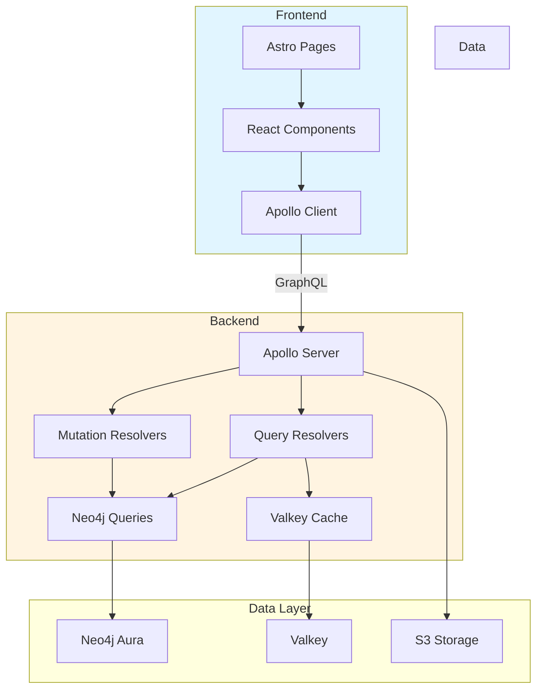

---
<!-- markdownlint-disable MD041 -->
<!-- markdownlint-disable MD013 -->

# Bunny Repository Index

**Last Updated:** 2025-12-30
**Project Type:** Unified Content Management Platform
**Status:** Active Development

---

## Project Overview

Bunny is a graph-native content management and reading platform that aggregates content from multiple sources (Reddit, RSS, social media, newsletters) into a unified feed experience. Built with Neo4j for relationship-rich data modeling, Valkey for high-performance caching, and Astro + React for a modern frontend.

### Key Characteristics
- **Architecture:** Full-stack GraphQL API with graph database backend
- **Design Philosophy:** Domain-driven design with Bunny UI components
- **Primary Use Case:** Content aggregation, filtering, and organization
- **Current Focus:** Bunny design refactoring with feed filtering and saved boards

---

## Technology Stack

### Backend
- **Runtime:** Node.js with TypeScript
- **API:** Apollo GraphQL Server v4.10.0
- **Database:** Neo4j Aura (graph database)
- **Cache:** Valkey (Redis-compatible)
- **Storage:** S3-compatible (MinIO/GCP/R2)
- **Key Dependencies:**
  - `neo4j-driver` v5.15.0 - Database connectivity
  - `@aws-sdk/client-s3` v3.490.0 - Object storage
  - `@xenova/transformers` v2.17.0 - AI embeddings
  - `sharp` v0.33.0 - Image processing
  - `graphql-upload` v15.0.0 - File uploads

### Frontend
- **Framework:** Astro 4.15.0 with React 19.2.3
- **Styling:** Tailwind CSS 3.4.13
- **State Management:** Apollo Client v3.11.0
- **Testing:** Vitest v1.1.3, Playwright v1.40.0, MSW v2.3.0
- **UI Components:** Lucide React v0.562.0, Recharts v3.6.0
- **Key Dependencies:**
  - `@apollo/client` - GraphQL client
  - `@google/genai` - AI integration
  - `msw` - Mock Service Worker for testing

---

## Directory Structure

```
Bunny/
├── app/
│   ├── backend/                 # GraphQL API Server
│   │   ├── src/
│   │   │   ├── index.ts         # Express + Apollo Server entry point
│   │   │   ├── schema/
│   │   │   │   └── schema.ts    # GraphQL type definitions
│   │   │   ├── resolvers/
│   │   │   │   ├── queries.ts   # Query resolvers (feed, creators, sources)
│   │   │   │   └── mutations.ts  # Mutation resolvers
│   │   │   ├── neo4j/
│   │   │   │   ├── driver.ts    # Neo4j connection & index creation
│   │   │   │   └── queries/
│   │   │   │       ├── feed.ts  # Feed queries with filtering
│   │   │   │       ├── creators.ts
│   │   │   │       ├── sources.ts
│   │   │   │       └── images.ts
│   │   │   ├── bunny/
│   │   │   │   ├── resolvers.ts # Bunny-specific resolvers
│   │   │   │   ├── queries.ts   # Board & identity profile queries
│   │   │   │   └── adapters.ts  # Data transformation utilities
│   │   │   ├── valkey/
│   │   │   │   └── client.ts    # Valkey cache client
│   │   │   └── services/
│   │   │       ├── clipEmbedder.ts
│   │   │       ├── duplicateDetector.ts
│   │   │       ├── imageHasher.ts
│   │   │       ├── imageIngestion.ts
│   │   │       ├── phashBucketing.ts
│   │   │       └── storage.ts
│   │   ├── storage/              # Local storage (development)
│   │   ├── package.json
│   │   ├── tsconfig.json
│   │   ├── Dockerfile
│   │   └── docker-compose.yml
│   │
│   └── frontend/                # Astro + React Frontend
│       ├── src/
│       │   ├── components/
│       │   │   ├── feed/        # Feed display components
│       │   │   │   ├── FeedView.tsx
│       │   │   │   ├── FeedSidebar.tsx
│       │   │   │   ├── FeedBoardSidebar.tsx
│       │   │   │   └── MediaLightbox.tsx
│       │   │   ├── feed-manager/ # Subscription management
│       │   │   │   ├── FeedManagerView.tsx
│       │   │   │   └── SourcesBoardView.tsx
│       │   │   ├── bunny/      # Bunny Feed components (NEW)
│       │   │   │   ├── BunnyFeed.tsx
│       │   │   │   ├── BunnyFeedWrapper.tsx
│       │   │   │   ├── FeedItem.tsx
│       │   │   │   ├── FilterBar.tsx
│       │   │   │   ├── Sidebar.tsx
│       │   │   │   └── EntityManager.tsx
│       │   │   ├── reader/      # Reader components
│       │   │   │   ├── ReaderView.tsx
│       │   │   │   ├── ArticleReader.tsx
│       │   │   │   ├── ArticleList.tsx
│       │   │   │   └── InsightsView.tsx
│       │   │   ├── dashboard/   # Dashboard components
│       │   │   │   ├── DashboardView.tsx
│       │   │   │   ├── StatsCard.tsx
│       │   │   │   ├── ActivityTimeline.tsx
│       │   │   │   ├── AIInsights.tsx
│       │   │   │   ├── FlaggedContentTable.tsx
│       │   │   │   └── TopSources.tsx
│       │   │   ├── admin/       # Admin console
│       │   │   │   └── AdminConsole.tsx
│       │   │   └── layout/      # Layout components
│       │   │       ├── Sidebar.tsx
│       │   │       ├── ThemeProviderWrapper.tsx
│       │   │       └── ThemeSwitcher.tsx
│       │   ├── layouts/
│       │   │   └── MainLayout.astro
│       │   ├── pages/           # Astro pages (routing)
│       │   │   ├── index.astro  # Home page (Bunny Feed)
│       │   │   ├── dashboard.astro
│       │   │   ├── admin.astro
│       │   │   ├── feed-manager.astro
│       │   │   ├── feed-control.astro
│       │   │   └── reader.astro
│       │   ├── lib/
│       │   │   ├── graphql/
│       │   │   │   ├── client.ts
│       │   │   │   ├── queries.ts
│       │   │   │   ├── mutations.ts
│       │   │   │   └── mocks/    # MSW mock data
│       │   │   ├── bunny/
│       │   │   │   ├── types.ts
│       │   │   │   ├── services/
│       │   │   │   │   ├── contentGraph.ts
│       │   │   │   │   ├── fixtures.ts
│       │   │   │   │   └── geminiService.ts
│       │   │   │   └── theme-adapter.ts
│       │   │   ├── themes/
│       │   │   │   ├── theme-config.ts
│       │   │   │   └── theme-context.tsx
│       │   │   ├── feed-config/
│       │   │   │   └── board-config.ts
│       │   │   └── utils/
│       │   │       ├── formatters.ts
│       │   │       └── deduplicate.ts
│       │   ├── styles/
│       │   │   └── global.css
│       │   └── test/
│       │       ├── setup.ts
│       │       └── test-utils.tsx
│       ├── scripts/
│       │   ├── generate-graphql-mock-data.ts
│       │   └── article-factory.ts
│       ├── tests/
│       │   ├── e2e/
│       │   │   ├── feed-display.spec.ts
│       │   │   └── mock-data-loading.spec.ts
│       │   └── README.md
│       ├── package.json
│       ├── tsconfig.json
│       ├── astro.config.mjs
│       ├── tailwind.config.mjs
│       ├── Dockerfile
│       └── docker-compose.yml
│
├── archive/                     # Archived extracted components
│   ├── bunny-feed-extracted/
│   └── reader-extracted/
│
├── docs/                        # Project documentation
│   ├── domains/
│   │   ├── feed/
│   │   └── subscriptions/
│   ├── architecture/
│   │   └── adr/
│   └── interfaces/
│
├── plans/                       # Planning documents
│   └── repository-index.md
│
├── README.md                    # Main project documentation
├── REFACTORING_PLAN.md          # Current refactoring plan
└── .gitignore
```

---

## Core Architecture

### System Flow



### Key Backend Components

#### 1. GraphQL Schema ([`app/backend/src/schema/schema.ts`](app/backend/src/schema/schema.ts))
- **Core Types:** `Media`, `Creator`, `Handle`, `Source`, `Subreddit`, `User`
- **Bunny Types:** `SavedBoard`, `FilterState`, `IdentityProfile`, `Relationship`
- **Queries:** `feed`, `creators`, `getSavedBoards`, `getIdentityProfiles`
- **Mutations:** `createSavedBoard`, `updateSavedBoard`, `deleteSavedBoard`, `createIdentityProfile`
- **Enums:** `Platform`, `MediaType`, `HandleStatus`

#### 2. Feed Query System ([`app/backend/src/neo4j/queries/feed.ts`](app/backend/src/neo4j/queries/feed.ts))
- **Function:** `getFeed(cursor, limit, filters)`
- **Filter Support:**
  - `persons[]` - Filter by entity/creator names
  - `sources[]` - Filter by subreddit names or platform types
  - `searchQuery` - Text search in post titles
- **Pagination:** Cursor-based using `publishDate`
- **Return Type:** `{ posts: FeedPost[], nextCursor: string | null }`

#### 3. Bunny Resolvers ([`app/backend/src/bunny/resolvers.ts`](app/backend/src/bunny/resolvers.ts))
- **Queries:**
  - `getSavedBoards(userId)` - Retrieve user's saved boards
  - `getIdentityProfiles(query, limit)` - Search identity profiles
  - `getIdentityProfile(id)` - Get full profile with sources and relationships
- **Mutations:**
  - `createSavedBoard(userId, input)` - Create new board with filters
  - `updateSavedBoard(id, input)` - Update board name or filters
  - `deleteSavedBoard(id)` - Delete a board
  - `createIdentityProfile(userId, input)` - Create new identity profile
  - `updateIdentityProfile(id, input)` - Update profile
  - `deleteIdentityProfile(id)` - Delete profile
  - `createRelationship(profileId, input)` - Add relationship between profiles
  - `deleteRelationship(profileId, targetId)` - Remove relationship

### Key Frontend Components

#### 1. Bunny Feed ([`app/frontend/src/components/bunny/BunnyFeed.tsx`](app/frontend/src/components/bunny/BunnyFeed.tsx))
- **Purpose:** Main feed view with filtering and saved boards
- **Features:**
  - Real-time feed with infinite scroll
  - Filter by persons (creators) and sources (subreddits)
  - Search query support
  - Save current filters as boards
  - Switch between saved boards
  - Theme integration with unified theme system
- **State Management:**
  - `filters` - Current filter state
  - `feedItems` - Loaded feed items
  - `savedBoards` - User's saved boards
  - `bunnyTheme` - Current theme
- **GraphQL Integration:**
  - Uses `FEED_WITH_FILTERS` query for feed data
  - Uses `GET_SAVED_BOARDS` for board management
  - Mutations for creating/deleting boards

#### 2. Bunny Sidebar ([`app/frontend/src/components/bunny/Sidebar.tsx`](app/frontend/src/components/bunny/Sidebar.tsx))
- **Purpose:** Navigation and board management
- **Features:**
  - Display saved boards
  - Select boards to apply filters
  - Delete boards
  - Theme switcher
  - View switcher (feed/admin)

#### 3. Filter Bar ([`app/frontend/src/components/bunny/FilterBar.tsx`](app/frontend/src/components/bunny/FilterBar.tsx))
- **Purpose:** Filter controls for feed
- **Features:**
  - Person filter (multi-select)
  - Source filter (multi-select)
  - Search input
  - Clear filters button
  - Save board button

#### 4. Entity Manager ([`app/frontend/src/components/bunny/EntityManager.tsx`](app/frontend/src/components/bunny/EntityManager.tsx))
- **Purpose:** Admin view for managing identity profiles
- **Features:**
  - Create/edit identity profiles
  - Manage sources (handles) for each profile
  - Set relationships between profiles
  - Configure aliases and context keywords

### GraphQL Client Setup

#### Queries ([`app/frontend/src/lib/graphql/queries.ts`](app/frontend/src/lib/graphql/queries.ts))
- `FEED_QUERY` - Basic feed without filters
- `FEED_WITH_FILTERS` - Feed with person/source/search filters
- `CREATORS_QUERY` - List creators
- `CREATOR_QUERY` - Get single creator
- `GET_SAVED_BOARDS` - Get user's saved boards
- `GET_IDENTITY_PROFILES` - Search identity profiles
- `GET_IDENTITY_PROFILE` - Get full profile

#### Mutations ([`app/frontend/src/lib/graphql/mutations.ts`](app/frontend/src/lib/graphql/mutations.ts))
- `CREATE_SAVED_BOARD` - Create new board
- `UPDATE_SAVED_BOARD` - Update board
- `DELETE_SAVED_BOARD` - Delete board
- `CREATE_IDENTITY_PROFILE` - Create identity profile
- `UPDATE_IDENTITY_PROFILE` - Update profile
- `DELETE_IDENTITY_PROFILE` - Delete profile
- `CREATE_RELATIONSHIP` - Add relationship
- `DELETE_RELATIONSHIP` - Remove relationship

---

## Current Development Focus

### Refactoring Plan ([`REFACTORING_PLAN.md`](REFACTORING_PLAN.md))

**Primary Goal:** Working feed that can be filtered and sorted, matching Bunny's design examples

**Example Boards to Implement:**
1. **"Linux Rice" board** - Filter by sources: r/unixporn, r/hyprland, r/kde, r/gnome, r/UsabilityPorn, r/battlestations
2. **"Queens of Pop++" board** - Filter by entities/persons: Taylor Swift, Selena Gomez

**Implementation Status:**

#### ✅ Completed
- Backend feed filtering by persons and sources
- Saved boards GraphQL schema and resolvers
- GraphQL schema includes `FeedFilters` input type
- Neo4j constraints and indexes for SavedBoard nodes
- Index page uses Bunny Feed component
- Bunny Sidebar component exists and matches design
- FilterBar component exists and matches design
- GraphQL queries and mutations exist

#### ⚠️ Needs Verification
- Feed filtering works end-to-end
- Saved boards work end-to-end
- Filter logic handles person names correctly
- Filter logic handles subreddit names correctly
- Multiple filters combine with AND logic

#### 🔄 In Progress
- Backend filter logic fixes (person/source matching)
- Branding updates from "RepostRadar" to "Bunny"
- Bunny Sidebar integration across all pages

---

## Development Workflow

### Prerequisites
- Docker and Docker Compose
- Neo4j Aura credentials (for production)
- Node.js/Bun (for local development)

### Backend Development

```bash
cd app/backend

# Using Docker (recommended)
docker-compose up --build

# Or locally
npm install
npm run dev
```

**Endpoints:**
- GraphQL API: `http://localhost:4002/api/graphql`
- Health Check: `http://localhost:4002/health`

**Environment Variables:**
```bash
NEO4J_URI=neo4j+s://your-instance.databases.neo4j.io
NEO4J_USERNAME=neo4j
NEO4J_PASSWORD=your-password
NEO4J_DATABASE=neo4j
VALKEY_URL=redis://localhost:6379
PORT=4002
```

### Frontend Development

```bash
cd app/frontend

# Using Docker (recommended)
docker-compose up --build

# Or locally
npm install
npm run dev
```

**Access:** `http://localhost:4321`

**Environment Variables:**
```bash
PUBLIC_GRAPHQL_ENDPOINT=http://localhost:4002/api/graphql
PUBLIC_GRAPHQL_MOCK=false
PUBLIC_WS_ENDPOINT=ws://localhost:4002/api/graphql
```

### Mock Data Development

The frontend supports mock data for development without backend dependencies:

```bash
cd app/frontend

# Generate mock data
npm run generate-mock-data

# Run with mock mode enabled
PUBLIC_GRAPHQL_MOCK=true npm run dev
```

### Testing

```bash
# Frontend unit tests
cd app/frontend
docker-compose exec frontend bun run test

# Frontend E2E tests
docker-compose exec frontend npm run test:e2e

# Backend tests (when added)
cd app/backend
npm run test
```

---

## Key Files Reference

### Backend Core Files

| File | Purpose | Key Functions/Types |
|------|---------|---------------------|
| [`app/backend/src/index.ts`](app/backend/src/index.ts) | Server entry point | Express + Apollo Server setup, health check |
| [`app/backend/src/schema/schema.ts`](app/backend/src/schema/schema.ts) | GraphQL schema | Type definitions, enums, inputs |
| [`app/backend/src/resolvers/queries.ts`](app/backend/src/resolvers/queries.ts) | Query resolvers | `feed`, `creators`, `getFeedGroups`, etc. |
| [`app/backend/src/resolvers/mutations.ts`](app/backend/src/resolvers/mutations.ts) | Mutation resolvers | `createCreator`, `addHandle`, `subscribeToSource` |
| [`app/backend/src/neo4j/queries/feed.ts`](app/backend/src/neo4j/queries/feed.ts) | Feed queries | `getFeed(cursor, limit, filters)` |
| [`app/backend/src/bunny/resolvers.ts`](app/backend/src/bunny/resolvers.ts) | Bunny resolvers | Board & identity profile CRUD |
| [`app/backend/src/neo4j/driver.ts`](app/backend/src/neo4j/driver.ts) | Neo4j driver | Connection, index creation |

### Frontend Core Files

| File | Purpose | Key Features |
|------|---------|--------------|
| [`app/frontend/src/components/bunny/BunnyFeed.tsx`](app/frontend/src/components/bunny/BunnyFeed.tsx) | Main feed component | Filtering, boards, theme integration |
| [`app/frontend/src/components/bunny/Sidebar.tsx`](app/frontend/src/components/bunny/Sidebar.tsx) | Navigation sidebar | Board management, theme switcher |
| [`app/frontend/src/components/bunny/FilterBar.tsx`](app/frontend/src/components/bunny/FilterBar.tsx) | Filter controls | Person/source/search filters |
| [`app/frontend/src/components/bunny/EntityManager.tsx`](app/frontend/src/components/bunny/EntityManager.tsx) | Admin view | Identity profile management |
| [`app/frontend/src/lib/graphql/queries.ts`](app/frontend/src/lib/graphql/queries.ts) | GraphQL queries | Feed, creators, boards, profiles |
| [`app/frontend/src/lib/graphql/mutations.ts`](app/frontend/src/lib/graphql/mutations.ts) | GraphQL mutations | Board/profile CRUD operations |
| [`app/frontend/src/lib/bunny/types.ts`](app/frontend/src/lib/bunny/types.ts) | TypeScript types | `FilterState`, `SavedBoard`, `IdentityProfile` |
| [`app/frontend/src/pages/index.astro`](app/frontend/src/pages/index.astro) | Home page | Bunny Feed wrapper |
| [`app/frontend/src/layouts/MainLayout.astro`](app/frontend/src/layouts/MainLayout.astro) | Main layout | Theme provider, global styles |

---

## Data Model

### Neo4j Graph Structure

```
(:Entity) -[:HAS_SOURCE]-> (:Source)
(:Source) -[:POSTED_IN]-> (:Subreddit)
(:Post) -[:APPEARED_IN]-> (:Media)
(:Post) -[:POSTED_IN]-> (:Subreddit)
(:User) -[:POSTED]-> (:Post)
(:Entity) -[:RELATED_TO]-> (:Entity)
(:SavedBoard) -[:BELONGS_TO]-> (:User)
(:Media) -[:BELONGS_TO]-> (:ImageCluster)
```

### Key Node Types

- **Entity**: Represents a person/creator (name, displayName, bio, aliases)
- **Source**: Represents a social media handle or subreddit (platform, username, handle)
- **Post**: Represents a content post (title, score, created_utc)
- **Media**: Represents media content (url, mime_type, width, height, phash)
- **Subreddit**: Represents a Reddit community (name, display_name, subscribers)
- **User**: Represents a Reddit user (username, karma)
- **SavedBoard**: Represents a saved filter configuration (name, filters, userId)
- **ImageCluster**: Groups duplicate/repost images together

---

## Known Issues & Technical Debt

### Backend Issues

1. **Person Filter Matching** ([`feed.ts:78-87`](app/backend/src/neo4j/queries/feed.ts:78-87))
   - Problem: Backend filters by `slug` or `id`, but frontend may pass `displayName`
   - Solution: Update backend to match by `displayName`, `name`, or `slug`

2. **Source Filter Matching** ([`feed.ts:90-103`](app/backend/src/neo4j/queries/feed.ts:90-103))
   - Problem: Backend filters by `platform` or `label`, but frontend may pass subreddit names
   - Solution: Update backend to match subreddit names (with/without "r/" prefix)

3. **Filter Combination Logic**
   - Problem: Need to ensure AND logic works correctly when multiple filters are provided
   - Solution: Review and fix Cypher query logic in `feed.ts`

### Frontend Issues

1. **Branding Inconsistency**
   - Some pages still use "RepostRadar" branding instead of "Bunny"
   - Files to update: `Sidebar.tsx`, `dashboard.astro`, others

2. **Sidebar Integration**
   - Decision needed: Use Bunny Sidebar for all pages or only feed pages?
   - Current: Old sidebar still used for admin/management pages

3. **Feed Sorting**
   - Currently only sorts by date (newest first)
   - Missing: Sort by score/likes, sort by relevance

---

## Getting Started Checklist

### For New Developers

- [ ] Read [`README.md`](README.md) for project overview
- [ ] Review [`REFACTORING_PLAN.md`](REFACTORING_PLAN.md) for current focus
- [ ] Set up Docker and Docker Compose
- [ ] Configure backend environment variables (`.env`)
- [ ] Start backend: `cd app/backend && docker-compose up`
- [ ] Start frontend: `cd app/frontend && docker-compose up`
- [ ] Access frontend at `http://localhost:4321`
- [ ] Explore GraphQL API at `http://localhost:4002/api/graphql`
- [ ] Review key components in `app/frontend/src/components/bunny/`
- [ ] Review backend resolvers in `app/backend/src/resolvers/`

### For Feature Development

1. **Backend Changes:**
   - Modify schema in [`app/backend/src/schema/schema.ts`](app/backend/src/schema/schema.ts)
   - Add/update resolvers in [`app/backend/src/resolvers/`](app/backend/src/resolvers/)
   - Add/update Neo4j queries in [`app/backend/src/neo4j/queries/`](app/backend/src/neo4j/queries/)
   - Test with GraphQL Playground

2. **Frontend Changes:**
   - Add/update components in `app/frontend/src/components/`
   - Add/update GraphQL queries/mutations in `app/frontend/src/lib/graphql/`
   - Update types in `app/frontend/src/lib/bunny/types.ts`
   - Test with unit tests and E2E tests

3. **Testing:**
   - Write unit tests in `__tests__` directories
   - Write E2E tests in `app/frontend/tests/e2e/`
   - Use mock data for frontend-only testing

---

## Next Steps

Based on the refactoring plan, the recommended next steps are:

1. **Fix Backend Filter Logic** (Priority: Critical)
   - Update [`app/backend/src/neo4j/queries/feed.ts`](app/backend/src/neo4j/queries/feed.ts) to handle person names correctly
   - Update source filtering to match subreddit names with/without "r/" prefix
   - Test filter combinations

2. **Verify End-to-End Functionality** (Priority: High)
   - Test feed filtering by persons
   - Test feed filtering by sources
   - Test saved boards creation/loading/deletion
   - Test example boards ("Linux Rice", "Queens of Pop++")

3. **Update Branding** (Priority: Medium)
   - Replace "RepostRadar" with "Bunny" in all files
   - Update page titles and meta descriptions
   - Integrate Bunny Sidebar across all pages

4. **Add Feed Sorting** (Priority: Low)
   - Add sort dropdown to FilterBar
   - Update backend to handle sorting
   - Test sorting functionality

---

## Additional Resources

- **Documentation:** [`docs/`](docs/) directory for domain-specific docs
- **Architecture Decisions:** [`docs/architecture/adr/`](docs/architecture/adr/) for ADRs
- **Testing Guide:** [`app/frontend/tests/README.md`](app/frontend/tests/README.md)
- **Mock Data Guide:** [`docs/domains/feed/mock-data-guide.md`](docs/domains/feed/mock-data-guide.md)
- **Bunny Integration:** [`docs/bunny-integration.md`](docs/bunny-integration.md)

---

## Contact & Support

For questions or issues:
- Review existing documentation in [`docs/`](docs/)
- Check [`REFACTORING_PLAN.md`](REFACTORING_PLAN.md) for current priorities
- Examine code comments and TypeScript types for inline documentation

